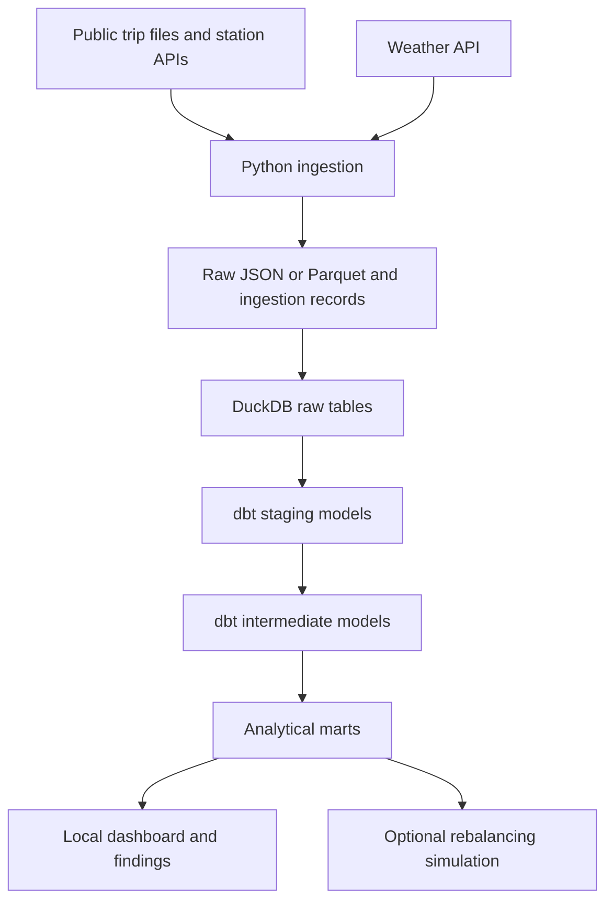

# Project charter: Bike Share Ops

## Purpose

I am building this project to learn dbt and develop my data engineering skills. I want to turn public bike-share data into reliable analysis that helps an operator understand demand and prioritize improvements to bike and dock availability.

## Intended user and decisions

A bike-share operations planner deciding which stations and periods need attention and how to allocate limited rebalancing resources.

Questions:

1. How do station departures and arrivals vary by hour, weekday, and season?
2. Which stations repeatedly have no available bikes or docks during observed periods?
3. How does demand vary with weather, without assuming causation?
4. How does a proposed rebalancing policy compare with a simple baseline under explicit simulation assumptions?
5. If suitable public location data exists, where might additional parking or docking capacity be worth investigating?

## Sources and evidence limits

- [Citi Bike trip history and GBFS feeds](https://citibikenyc.com/system-data): historical completed trips and current station metadata/status. The initial scope will be a bounded dataset, selected after checking its schema, size, and quality.
- [Open-Meteo historical weather API](https://open-meteo.com/en/docs/historical-weather-api): weather context from reanalysis data. Access conditions and attribution will be documented before ingestion.
- Optional dockless bike/scooter trip data: clustering will depend on public availability, geographic precision, terms, and suitability.

Completed trips do not measure unmet demand. Missing station identifiers do not prove an off-station drop-off. Live availability history begins with our collector; gaps and stale observations must not be treated as uninterrupted coverage. Observed drop-off clusters do not by themselves establish pickup demand or suitable construction sites. Station expansion is exploratory and must account for departures, coverage, and data quality; feasibility constraints may remain outside scope.

## Architecture and budget

This is the planned architecture. Python will collect source data and load raw tables into DuckDB. dbt will run SQL transformations inside DuckDB to create staging models, intermediate models, and analytical marts. DuckDB stores the data; dbt manages the transformation workflow, tests, and documentation.

I am using VS Code and a local stack without paid infrastructure, trial sessions, or required cloud credentials. Dashboard tooling is still to be selected. Live collection will use scheduled local polling, with collection gaps recorded. Optional GitHub automation will stay within available free usage; local execution will remain independent of it.

## Milestones and acceptance criteria

Milestone 1 is complete. Milestone 2 is in progress: the January 2025 archive has been downloaded and profiled. Raw-table loading and the first dbt model remain. [Source inspection](DATA_SOURCE.md) records the initial evidence.

| Milestone | Deliverable | Acceptance evidence |
| --- | --- | --- |
| 1. Foundation | Project/repository rename, charter, VS Code setup | Configuration parses, DuckDB connects, references agree, commit reaches GitHub |
| 2. Historical foundation | Bounded data, source profiling, first dbt model | Document table grain and source terms; reconcile counts from input to output |
| 3. Trustworthy analytics | Facts/dimensions, tests, documentation, dashboard | Business-rule checks pass; joins preserve intended grain; screenshots and findings trace to queries |
| 4. Live operations | Status collection, incremental models, monitoring, recovery | Safe reruns; explicit coverage gaps; incremental/full rebuild comparison; demonstrated failure recovery |
| 5. Portfolio delivery | Reproducible sample, CI, lineage, runbook, tradeoffs | Fresh checkout runs without credentials; CI validates sample transformations; publish evidence-backed findings |
| 6. Optional decision support | Rebalancing simulation and/or station-location exploration | Compare with baseline; disclose assumptions; retain only conclusions supported by suitable data |

## Engineering approach

Each table will have a documented grain, key, and timestamp convention. Raw data and ingestion metadata will support tracing results back to their sources. As ingestion develops, I will address retries, duplicate loads, delayed records, and schema changes.

Tests will cover important business rules and complex transformations. Operational documentation will describe freshness checks, failures, and recovery. Performance comparisons will identify the dataset and environment used.

A small reproducible sample will be included where source terms permit redistribution. Bulk downloads, local databases, and credentials will stay outside version control.

## Final portfolio evidence

- Business problem and a few evidence-backed findings.
- Architecture diagram, generated dbt lineage, and dashboard screenshots.
- Small reproducible sample that runs without cloud credentials.
- Passing CI, setup instructions, and a recovery runbook.
- Concise design tradeoffs and measured improvements.
