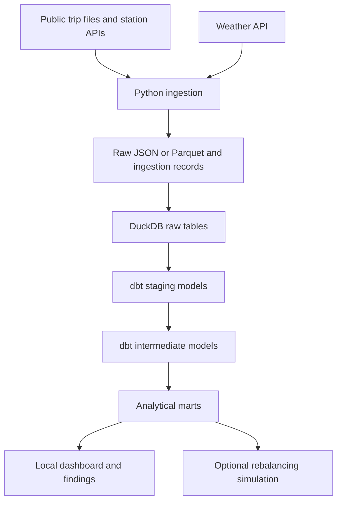

# Project charter: Bike Share Ops

## Purpose

Build a reproducible portfolio project that turns public bike-share data into trustworthy operational analysis. Learn dbt and data engineering through small implementations that the author can explain and defend.

## Intended user and decisions

A bike-share operations planner deciding which stations and periods need attention and how to allocate limited rebalancing resources.

Questions:

1. How do station departures and arrivals vary by hour, weekday, and season?
2. Which stations repeatedly have no available bikes or docks during observed periods?
3. How does demand vary with weather, without assuming causation?
4. How does a proposed rebalancing policy compare with a simple baseline under explicit simulation assumptions?
5. If suitable public location data exists, where might additional parking or docking capacity be worth investigating?

## Sources and evidence limits

- [Citi Bike trip history and GBFS feeds](https://citibikenyc.com/system-data): historical completed trips and current station metadata/status. Select a bounded dataset after inspecting its actual schema, size, and quality.
- [Open-Meteo historical weather API](https://open-meteo.com/en/docs/historical-weather-api): weather context from reanalysis data. Confirm access conditions and attribution before ingestion.
- Optional dockless bike/scooter trip data: investigate public availability, geographic precision, terms, and suitability before committing to clustering.

Completed trips do not measure unmet demand. Missing station identifiers do not prove an off-station drop-off. Live availability history begins with our collector; gaps and stale observations must not be treated as uninterrupted coverage. Observed drop-off clusters do not by themselves establish pickup demand or suitable construction sites. Station expansion is exploratory and must account for departures, coverage, and data quality; feasibility constraints may remain outside scope.

## Architecture and budget

This is the planned architecture, not a deployed system. Use Python, DuckDB, dbt, Git, and VS Code locally. No paid infrastructure, trial sessions, or required cloud credentials. Choose dashboard tooling later; the core project must remain reproducible without a paid BI license. Use scheduled local polling rather than promising continuous uptime. Any optional GitHub automation must fit available free usage and is not required for local execution.

## Milestones and acceptance criteria

| Milestone | Deliverable | Acceptance evidence |
| --- | --- | --- |
| 1. Foundation | Project/repository rename, charter, VS Code setup | Configuration parses, DuckDB connects, references agree, commit reaches GitHub |
| 2. Historical foundation | Bounded data, source profiling, first dbt model | Document table grain and source terms; reconcile counts from input to output |
| 3. Trustworthy analytics | Facts/dimensions, tests, documentation, dashboard | Business-rule checks pass; joins preserve intended grain; screenshots and findings trace to queries |
| 4. Live operations | Status collection, incremental models, monitoring, recovery | Safe reruns; explicit coverage gaps; incremental/full rebuild comparison; demonstrated failure recovery |
| 5. Portfolio delivery | Reproducible sample, CI, lineage, runbook, tradeoffs | Fresh checkout runs without credentials; CI validates sample transformations; publish evidence-backed findings |
| 6. Optional decision support | Rebalancing simulation and/or station-location exploration | Compare with baseline; disclose assumptions; retain only conclusions supported by suitable data |

## Engineering standards to introduce as needed

Define grains, keys, timestamps, and time zones. Preserve raw evidence and ingestion metadata. Handle retries, duplicate loads, delayed records, and schema changes. Test complex transformation logic and important business rules. Record freshness, failures, and recovery steps. Benchmark changes on a named dataset and environment before claiming improvements.

Commit a small reproducible sample only after checking source terms; exclude bulk downloads and local databases. Do not publish credentials. Keep documentation honest about what is planned and what has been verified.

## Mentorship and daily progress

Use a cycle of explain → implement → review → verify → commit → push. The author implements the learning tasks; the mentor supplies explanations, hints, examples, review, and debugging assistance as needed. Size work to the author's available time rather than imposing a fixed schedule.

Aim for one meaningful daily deliverable: code, a useful test, a documented modeling decision, source profiling, or an evidence-backed finding. Record actual dates and outcomes; do not manufacture empty commits or backdate progress. Publish a LinkedIn draft for author review after defensible results exist; publishing is a separate decision.

## Final portfolio evidence

- Business problem and a few evidence-backed findings.
- Architecture diagram, generated dbt lineage, and dashboard screenshots.
- Small reproducible sample that runs without cloud credentials.
- Passing CI, setup instructions, and a recovery runbook.
- Concise design tradeoffs and measured improvements.
